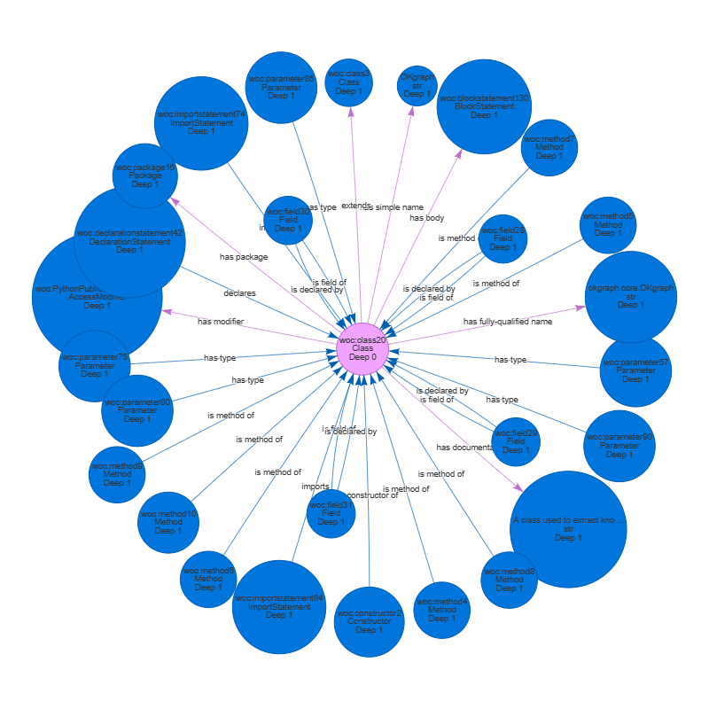

# CodeOntologyPython


## What is it?
___
**CodeOntologyPython** is a stand-alone *Python3* tool that **analyzes the source of *Python* projects** to **generate a knowledge graph representation of the code**.
It has been developed as a *Python* extension and adaptation of the extraction tool for *Java* projects that is part of the [CodeOntology project](http://codeontology.org/).

*CodeOntologyPython* includes both:
 - an [**ontology**](codeontology/ontology/codeontology.owl) adapted **to model multi-paradigm languages** (such as *Python*) at a statement-grained level;
 - a [**parser**](codeontology/rdfization/python3), to manage and **extract *RDF triplets* of *Python* projects** and its dependencies in conformity with the ontology.

## How to run it?
___

### Installation
To get *CodeOntologyPython* running, clone the repository, create a *Python3* environment (*Python 3.9.13* was used in development) and install the requirements.
```bash
>>> git clone https://github.com/SandroGT/CodeOntologyPython.git
>>> python -m venv venv
>>> source venv/bin/activate
>>> (venv) pip install -r requirements
```

:warning: ***CodeOntologyPython* is a stand-alone tool** that should have its own environment, not a library to include in your project environments. Its functions and features may have side effects that could harm your code execution flow, such as manipulating the value of the built-in variable `sys.path`.

### Running
You can run *CodeOntologyPython* from the command line and check the commands and parameters available through the help message.
```bash
>>> python -m codeontology python3 -h
```
*CodeOntologyPython* intended to support extraction features for multiple languages, so the language (*python3*) is also a parameter, even though the only value available yet.

You can run the extraction on a locally available project source. For more details, see the help message.
```bash
>>> python -m codeontology python3 local -h
```
Otherwise, you can run the extraction of a project available on the *Python index*, automatically downloading its source with `pip`. Again, you can get more details with the help message.
```bash
>>> python -m codeontology python3 pypi -h
```

The source code referenced must be a project that includes the installation information needed to retrieve the project dependencies. It is not possible to parse source folders that you can't install via `pip`. For this reason, extracting a project available in the *Python index* is more likely to fail since it is not always possible to retrieve the source of a project via `pip`. In this case, try searching for the source yourself and run it locally.

### Use case
You can download the Python [*okgraph*](https://github.com/atzori/okgraph) library source as a test case and perform the local extraction with *CodeOntologyPython*.

```bash
>>> python -m codeontology python3 local path/to/okgraph_folder
```
The tool will download the [*okgraph*](https://github.com/atzori/okgraph) dependencies and proceed with parsing all the sources, transforming the ASTs, extracting the triplets, and saving them in a file in the *N-Triples* format.

You can then load the triplets into third-party tools to query with *SPARQL*. For example, you can request the libraries that were found:

```sparql
prefix woc: <http://rdf.webofcode.org/woc/>

SELECT DISTINCT ?n_lib
WHERE {
    ?lib rdf:type woc:Library .
    ?lib woc:hasName ?n_lib .
}
```

You would obtain as answer the following list of libraries:

```text
 1 (abc)
 2 (builtins)
 3 (docs)
 4 (gensim)
 5 (itertools)
 6 (logging)
 7 (math)
 8 (nt)
 9 (ntpath)
10 (numpy)
11 (okgraph)
12 (operator)
13 (os)
14 (pymagnitude)
15 (re)
16 (requests)
17 (shutil)
18 (sphinx)
19 (string)
20 (tests)
21 (transformers)
22 (typing)
23 (unittest)
24 (whoosh)
```

For demonstration, we run a query asking for the star involving the node of the class [OKgraph](https://github.com/atzori/okgraph/blob/898d790af91a41ab2c9f0b804712c29d489edde1/okgraph/core.py#L18). We present the [result](docs/okgraph_class_star_deep1.html) using [**pyvis**](https://github.com/WestHealth/pyvis).



Things start to get a little messy if we extend the star to patterns of length two, as shown [here](docs/okgraph_class_star_deep2.html).

You can obviously perform more meaningful queries, searching for more detailed info or particular patterns.


## Acknowledgments
___
The parsing capabilities of *CodeOntologyPython* rely on [**astroid**](https://github.com/PyCQA/astroid) for *Python* grammar and [**docstring-parser**](https://github.com/rr-/docstring_parser) for in-code documentation. The ontology handling and the population of the knowledge graph with new triplets are managed via [**owlready2**](https://github.com/pwin/owlready2).


## Status and possible improvements
___
**This repository is still under development**. Although the main features have been made available, and it is possible to get a complete extraction of sources like the one in the use case example, things can still go sideways. Some reasons usually are unexpected clauses when translating from the AST structure to the ontology or illegal operations when applying the custom transformations added to *astroid* to track the use of variables, functions, and methods necessary to represent their use in the graph.
Besides a more thorough testing and review of the current implementation, other improvements that would be a fine addition are:

- eliminate the need for the installation information, ignoring project dependencies if the user wishes;
- improve code efficiency and memory usage by switching from recursive to iterative implementations when possible;
- improve the static inference of the object types;
- add linking from the calls to executables to their referenced functions and methods (only possible with objects of known type).

These are the main ones, but surely others may come up. As of now, there is no planning for their integration and development.